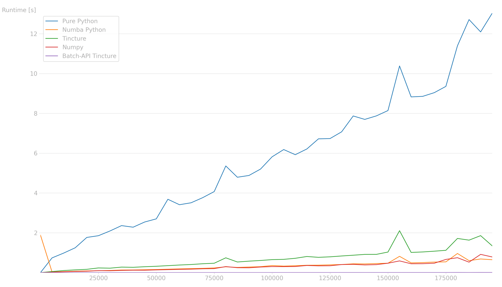
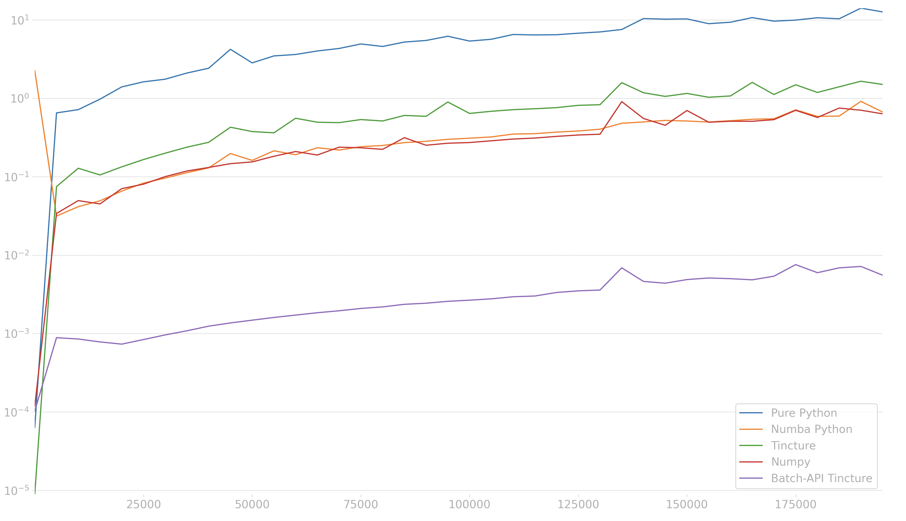

<h1 style="text-align: center;">Tincture Python Color Library</h1>


## Tincture Overview
### DISCLAIMER
As of now, the library is not ready to be used for production. It is currently being developed and tested, only once it
gets published in PyPi it will be ready for production-use, multi-language support will start with rust and python then
keep evolving
---

Tincture is a high-performance, cross-language color manipulation library 
that combines SIMD acceleration, multithreading, and a compact native core to deliver lightning-fast blending, 
interpolation, color operations and color space conversions. Designed for Python, Rust, JavaScript/TypeScript, 
and Java, it offers a unified API, rich built-in color theory tools, and a tiny ~1 MB footprint — performance without the bloat.

## Why Choose Tincture For Your Project?
1. ⚡ **Blazingly Fast Effortlessly** Performance is embedded in tincture's goals, tincture tries to use SIMD
instructions everywhere it can, while also packs the RGBA fields into a 32-bit integer to ensure memory alignment and caching. 
The Batch-API not only utilizes parallel threads but also lazy evaluation and SIMD to achieve and deliver a lightning fast 
experience to your users. Up to <strong>100x</strong> improvement in speed over numpy equivalent operations and numba 
equivalent implementation and completely decimating python with up to <strong>3000x</strong> speed as shown in [Benchmark Graph Overview](#benchmark-graph-overview)
<br /> <br />
2. **🧑‍🎨 High-Level Builtin Features** No more trying and failing to implement yourself color math as common color
theory is in the core of tincture for <u>Your Convenience</u>. You can get data from colors, interpolate the colors, blend
them together, convert between multiple color spaces, perform arithmetic on them. <u>Truly Endless</u> possibilities
<br /> <br />
3. **💻 Multi-Language Support** Tired of having to learn, adapt and juggle multiple color libraries in different programming
languages? Tincture aims to facilitate a _mostly_ language-agnostic ecosystem, providing the same API in 
<u>Python, Rust, Javascript/Typescript and even Java with more languages coming soon!</u>
<br /> <br />
4. **📦 Tiny but Mighty** Despite packing advanced SIMD acceleration, parallel batch processing, and a rich set of 
color operations, Tincture’s native core is lean with the Python extension is just ~1 MB which means lightning-fast 
installs and minimal footprint in your projects. Performance without the bulk.
---
All the documentation in tincture is written in docstrings (python). There is planned to be a website for hosting references 
and guides, but in the meantime, you can check the docstrings and in addition, here are some examples of using 
tincture to get you started on using it

## Using Tincture Is a Piece Of Cake
Getting started is as simple as installing the library via
```shell
pip install tincture

# More languages coming soon
```
One of tincture's strength is the high level features it offers, making it a user friendly library 
<br />
_Basic Usage_
```python
from tincture import Color

# Creating a color (alpha value is equal to 255)
color = Color(123, 255, 102)

# Invert and grayscale it
print(color.inverse())  # Invert the color
print(color.grayscale())  # Grayscale the color
```

```python
import tincture
from tincture import Color

# Blend red and blue at 50%
result = Color.clerp(tincture.RED, tincture.BLUE, 0.5)
print(result) # Display the color
print(result.to_hex()) # Convert to HEX
```

_Color Manipulation_
```python
import tincture
from tincture import Color

# Some Basic Methods To Use(With Way More In The Module)
if __name__ == "__main__":
    color = tincture.RED
    color.clerp_inplace(tincture.BLUE, 0.3)
    inverse_color = color.inverse(False)
    shifted_color = color << 2 # Tincture also supports multiple operators
    grayscaled_color = color.grayscale()
    white = color.from_hex("#ffffff")  # or just color.from_hex("ffffff")
    max_color = white.max(tincture.BLACK)
    clamped_color = tincture.RED.clamp(120, 220);
    clamped_color2 = tincture.RED.clamp(Color(100, 110, 120), Color(200, 210, 220));
    randomised_color = tincture.WHITE.randomise(
        start=[0, 20, 40, 60],
        end=[40, 30, 50, 80]
    )
    tensored_color = tincture.DARK_RED.tensor(tincture.DARK_BLUE)
    added_color = color + inverse_color
    print(color)
    print(repr(color))
```

_Color Transitions Via Lerping_

```python
import tincture
from tincture import Color

if __name__ == "__main__":
    amount = 100
    start_color = Color(30, 210, 255)
    end_color = tincture.LIGHT_CYAN
    for i in range(amount):
        t = i / amount
        start_color.clerp_inplace(end_color, t)
        print(start_color)
```

_Color Conversion_

```python
from tincture import Color

if __name__ == "__main__":
    color = Color.from_hsv(30, 0.6, 1.0, 0.4)
    color2 = Color.from_lch(0.35, 0.83, 42, 0.24)
    color3 = Color.from_cmyk(0.35, 0.83, 0.234, 0.925, 0.32)
    color4 = Color.from_xyz(92.14, 23.321, 45.824, 0.312)
    color5 = Color.from_hex("ffffff")
    print(color.to_xyz())
    print(color.to_hex(include_transparency=False))
    print(color.to_hex(include_transparency=True))
    print(color.to_oklab())
    print(color.to_cmyk())
    print(color.to_decimal_rgb())
    print(color.to_hsl())
```

_Color Data_

```python
import tincture

if __name__ == "__main__":
    color = tincture.PURPLE
    print(color.get_saturation())
    print(color.get_luminance())
    print(color.triadic_colors())
    print(color.complementary_color())
    print(color.tetradic_color())
    print(color.contrast_ratio(tincture.BLUE))
```
## Contributing / License
Tincture is licensed under the MIT License — you’re free to use, modify, and distribute it in both personal and commercial projects, with attribution.
See the [LICENSE file](./LICENSE) for full details.

Contributions are welcome with open wide arms! Whether it’s bug fixes, new features, 
documentation improvements, or performance tweaks, all help is appreciated.
**How to contribute:**
- Fork the repository
- Create a new branch for your feature or fix
- Commit your changes with clear messages
- Open a pull request describing your changes

Please make sure to follow the project’s coding style and include rigorous tests where applicable. Ideally before commiting run
```shell
cargo clippy && cargo fmt
```

## Benchmark Graph Overview
The two below graphs are running the same operations which are:
```swift
// Color Addition
color + RED + BLUE + GREEN
color + RED + BLUE + GREEN
color + RED + BLUE + GREEN
color + RED + BLUE + GREEN

// Color Subtraction
color - RED - BLUE - GREEN
color - RED - BLUE - GREEN
color - RED - BLUE - GREEN
color - RED - BLUE - GREEN
                             
// Color Tensor Product 
color * RED * BLUE * GREEN
color * RED * BLUE * GREEN
color * RED * BLUE * GREEN
color * RED * BLUE * GREEN
```
All the implementations are similar with the exception of Numpy and Batch-API, where they use
the following optimized code (to ensure SIMD, Parallel work... etc):
```python
import numpy as np
import tincture

def parallel_tincture_test(data):
    batch = tincture.ColorBatch(data)
    batch.add([
        tincture.RED, tincture.BLUE, tincture.GREEN,
        tincture.RED, tincture.BLUE, tincture.GREEN,
        tincture.RED, tincture.BLUE, tincture.GREEN,
        tincture.RED, tincture.BLUE, tincture.GREEN
    ]).sub([
        tincture.RED, tincture.BLUE, tincture.GREEN,
        tincture.RED, tincture.BLUE, tincture.GREEN,
        tincture.RED, tincture.BLUE, tincture.GREEN,
        tincture.RED, tincture.BLUE, tincture.GREEN
    ]).mul([
        tincture.RED, tincture.BLUE, tincture.GREEN,
        tincture.RED, tincture.BLUE, tincture.GREEN,
        tincture.RED, tincture.BLUE, tincture.GREEN,
        tincture.RED, tincture.BLUE, tincture.GREEN
    ]).operate_inplace()

def numpy_test(data):
    red_mask = np.array([255, 0, 0, 255], dtype=np.float32)
    green_mask = np.array([0, 255, 0, 255], dtype=np.float32)
    blue_mask = np.array([0, 0, 255, 255], dtype=np.float32)

    data + red_mask + blue_mask + green_mask
    data + red_mask + blue_mask + green_mask
    data + red_mask + blue_mask + green_mask
    data + red_mask + blue_mask + green_mask

    data - red_mask - blue_mask - green_mask
    data - red_mask - blue_mask - green_mask
    data - red_mask - blue_mask - green_mask
    data - red_mask - blue_mask - green_mask

    data * red_mask * blue_mask * green_mask
    data * red_mask * blue_mask * green_mask
    data * red_mask * blue_mask * green_mask
    data * red_mask * blue_mask * green_mask
```
These 2 graphs are the same just the former is displayed in linear scale while the latter is displayed in logarithmic. The X
axis represents the colors processed simultaneously while the Y axis represents how much time it took to execute
<p align="center">
 
</p>